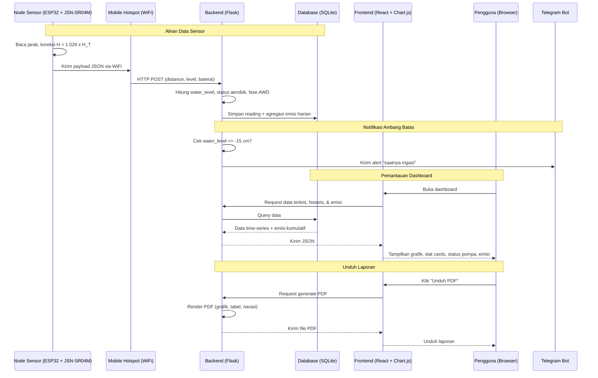
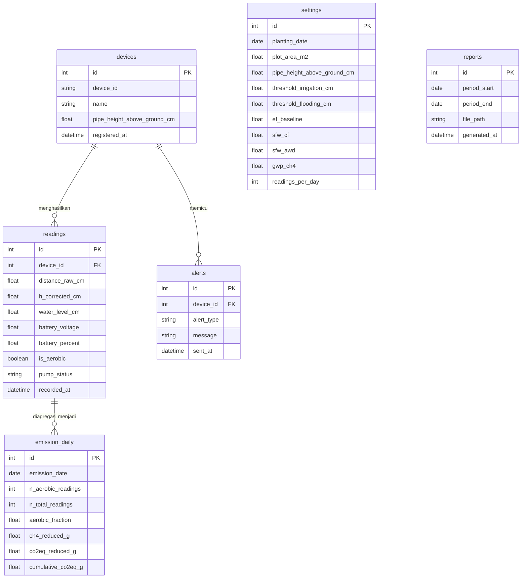

# PRD — Project Requirements Document
## Sistem Pemantauan Water Level Berbasis IoT untuk Implementasi AWD (Alternate Wetting and Drying) sebagai Strategi Pengurangan Emisi Gas Rumah Kaca pada Budidaya Padi Sawah

## 1. Overview

Aplikasi ini merupakan *IoT Monitoring Dashboard* berbasis web yang dikembangkan sebagai perangkat lunak pendukung prototipe sistem pemantauan tinggi muka air (*water level*) pada sawah padi yang menerapkan teknik irigasi *Alternate Wetting and Drying* (AWD). Masalah utama yang diselesaikan adalah beratnya beban kerja petani dalam memantau tinggi muka air secara manual setiap hari sepanjang fase pengeringan AWD, yang menjadi hambatan utama adopsi teknik hemat air ini.

Sistem mengadaptasi arsitektur SmartWT (Mascherpa et al., 2026) dengan substitusi komponen lokal Indonesia dan menambahkan dua kontribusi utama: (a) dashboard analitik *self-hosted* yang menampilkan dinamika tinggi muka air secara *real-time*, dan (b) estimasi pengurangan emisi metana (CH4) berbasis metode IPCC (2019) yang dihitung secara proporsional terhadap durasi kondisi aerobik tanah.

Tujuan utama aplikasi adalah menyediakan platform berbasis web yang (a) menampilkan data tinggi muka air dari sensor secara *real-time* dan historis, (b) menghitung serta memvisualisasikan estimasi pengurangan emisi CH4 dan CO2-ekuivalen secara kumulatif sejak hari tanam, (c) menampilkan status logika pompa (ON/OFF) sebagai indikator implikasi kontrol irigasi, dan (d) menghasilkan laporan PDF berisi ringkasan kinerja sistem.

## 2. Requirements

Persyaratan tingkat tinggi untuk pengembangan sistem:

- **Aksesibilitas:** Aplikasi diakses melalui Web Browser pada jaringan lokal (*localhost*), dioptimalkan untuk desktop/laptop sebagai pusat pemantauan riset.
- **Sumber Data:** Data berasal dari satu *node* sensor lapangan (ESP32 + JSN-SR04M) yang mengirim data melalui WiFi (*mobile hotspot*) setiap interval 2 jam.
- **Penyimpanan:** Seluruh data deret waktu (*time-series*) disimpan dalam basis data lokal SQLite, tanpa ketergantungan layanan cloud berbayar.
- **Analisis:** Sistem menghitung tinggi muka air terkoreksi, status fase AWD, durasi kondisi aerobik, serta estimasi emisi CH4 dan CO2-ekuivalen secara otomatis.
- **Laporan:** Hasil pemantauan dapat diunduh sebagai laporan PDF bergaya formal dengan grafik, tabel statistik, dan narasi ringkasan.
- **Notifikasi:** Sistem mengirim notifikasi (Telegram) ketika tinggi muka air mencapai ambang batas irigasi AWD (-15 cm).
- **Kemandirian:** Seluruh sistem (*backend*, basis data, *frontend*) berjalan di satu perangkat tanpa biaya berlangganan, sejalan dengan prinsip keterjangkauan dan replikabilitas.

## 3. Core Features

Fitur-fitur kunci dalam versi pertama (MVP):

1.  **Penerimaan Data Sensor (Data Ingestion)**
    - *Endpoint* API (HTTP POST) untuk menerima payload JSON dari ESP32.
    - Payload berisi: jarak mentah sensor (cm), tinggi muka air terkoreksi (cm), tegangan baterai (V), dan ID perangkat.
    - Validasi dan penyimpanan otomatis ke SQLite, dengan *timestamp* dibuat di sisi server saat data diterima.

2.  **Dashboard Pemantauan Real-Time** — *halaman utama*
    - Kartu statistik ringkas: tinggi muka air terkini, hari setelah tanam (DAP), fase AWD aktif, persentase baterai.
    - Grafik deret waktu tinggi muka air dengan dua garis acuan: ambang genangan (+5 cm) dan ambang kering aman AWD (-15 cm).
    - Penanda zona: area di atas 0 cm (tergenang/anaerobik) dan di bawah 0 cm (kering/aerobik).
    - Indikator status pompa virtual (ON/OFF) beserta penjelasan logikanya.

3.  **Modul Estimasi Emisi (Emission Analytics)** — *halaman utama*
    - Perhitungan durasi kondisi aerobik secara proporsional (fraksi pembacaan per hari).
    - Estimasi pengurangan emisi CH4 kumulatif (gram) sejak hari tanam.
    - Konversi ke CO2-ekuivalen.
    - Grafik akumulasi emisi tersisihkan dari waktu ke waktu.
    - Parameter luas petak dapat dikonfigurasi (default 100 m2).

4.  **Riwayat Data (Data History)** — *halaman terpisah*
    - Tabel data historis tinggi muka air dan emisi harian per tanggal.
    - Filter berdasarkan rentang tanggal.
    - Grafik historis sepanjang musim tanam.

5.  **Laporan PDF (Report Generation)**
    - Unduh laporan PDF berisi: grafik tinggi muka air, tabel statistik harian, total emisi tersisihkan (CH4 dan CO2-eq), dan narasi ringkasan kinerja AWD.

6.  **Notifikasi Telegram (Alerting)**
    - Notifikasi otomatis ketika tinggi muka air <= -15 cm ("saatnya irigasi").
    - Notifikasi peringatan baterai lemah ketika tegangan di bawah ambang aman.

7.  **Pengaturan Sistem (Settings)**
    - Konfigurasi parameter: tanggal tanam, luas petak, tinggi pipa, ambang batas, dan konstanta faktor emisi.
    - Konfigurasi token Telegram Bot.

## 4. Logika Perhitungan (Computation Logic)

> **Bagian ini adalah inti sistem dan harus diimplementasikan persis seperti tertulis. Seluruh konstanta dan rumus telah diverifikasi dan konsisten dengan laporan penelitian (Subbab 3.7 dan 3.8).**

### 4.1 Konversi Tinggi Muka Air

Sensor mengukur jarak mentah ke permukaan air (`distance_raw`, cm). Firmware ESP32 menerapkan faktor koreksi SmartWT:

```
H_corrected = 1.028 * distance_raw
```

Tinggi muka air relatif terhadap permukaan tanah dihitung di *backend*:

```
water_level = pipe_height_above_ground - H_corrected
```

dengan `pipe_height_above_ground` adalah tinggi bagian pipa di atas permukaan tanah (cm), default **20 cm** (sesuai instalasi: pipa total 50 cm, tertanam 30 cm).

**Interpretasi tanda:**
- `water_level > 0` -> air di atas permukaan tanah (tergenang/anaerobik).
- `water_level < 0` -> air di bawah permukaan tanah (kering/aerobik).

### 4.2 Konstanta Emisi (IPCC 2019)

Konstanta disimpan di tabel `settings` dan **tidak boleh di-hardcode** di frontend agar dapat dikalibrasi:

| Konstanta | Simbol | Nilai default | Satuan |
|-----------|--------|---------------|--------|
| Faktor emisi dasar | `ef_baseline` (EFc) | 1.30 | kg CH4 ha^-1 hari^-1 |
| Faktor skala air, flooding | `sfw_cf` | 1.00 | - |
| Faktor skala air, AWD | `sfw_awd` | 0.55 | - |
| Potensi pemanasan global CH4 | `gwp_ch4` | 28 | - |
| Luas petak | `plot_area_m2` | 100 | m2 |
| Interval pembacaan | `readings_per_day` | 12 | pembacaan/hari (tiap 2 jam) |

### 4.3 Potensi Pengurangan Emisi Harian (Aerobik Penuh)

Selisih faktor emisi antara penggenangan terus-menerus dan AWD:

```
delta_EF = ef_baseline * (sfw_cf - sfw_awd)
         = 1.30 * (1.00 - 0.55)
         = 0.585 kg CH4 ha^-1 hari^-1
```

Dikonversi ke gram per petak (untuk kondisi aerobik penuh 24 jam):

```
ch4_full_day = delta_EF * (plot_area_m2 / 10000) * 1000
             = 0.585 * (100 / 10000) * 1000
             = 5.85 gram CH4 / hari   (untuk petak 100 m2)
```

> **PERINGATAN IMPLEMENTASI:** `plot_area_m2 / 10000` mengonversi m2 ke hektar; `* 1000` mengonversi kg ke gram. Urutan dan faktor ini **tidak boleh diubah**. Untuk luas petak lain, nilai ini berubah linear (mis. 200 m2 -> 11.70 gram/hari).

### 4.4 Perhitungan Proporsional Berbasis Durasi Aerobik

Emisi **tidak** dihitung secara biner per hari. Setiap pembacaan (interval 2 jam) dievaluasi: jika `water_level < 0`, pembacaan tersebut dihitung sebagai kondisi aerobik. Fraksi hari aerobik:

```
aerobic_fraction = n_aerobic_readings / readings_per_day
```

dengan `n_aerobic_readings` = jumlah pembacaan dengan `water_level < 0` dalam satu hari, dan `readings_per_day` = 12.

Estimasi pengurangan emisi metana harian:

```
ch4_reduced_g = aerobic_fraction * ch4_full_day
              = (n_aerobic_readings / 12) * 5.85   (untuk petak 100 m2)
```

Konversi ke CO2-ekuivalen:

```
co2eq_reduced_g = ch4_reduced_g * gwp_ch4
                = ch4_reduced_g * 28
```

### 4.5 Tabel Verifikasi (WAJIB cocok saat pengujian)

Implementasi **harus** menghasilkan nilai berikut untuk petak 100 m2. Gunakan sebagai *test case*:

| n_aerobic (dari 12) | Durasi | aerobic_fraction | ch4_reduced_g | co2eq_reduced_g |
|---------------------|--------|------------------|---------------|-----------------|
| 0 | 0 jam | 0.000 | 0.00 | 0.00 |
| 1 | 2 jam | 0.083 | 0.49 | 13.65 |
| 3 | 6 jam | 0.250 | 1.46 | 40.95 |
| 6 | 12 jam | 0.500 | 2.93 | 81.90 |
| 9 | 18 jam | 0.750 | 4.39 | 122.85 |
| 12 | 24 jam | 1.000 | 5.85 | 163.80 |

> Nilai `ch4_reduced_g` dibulatkan 2 desimal untuk tampilan, namun **akumulasi harus memakai nilai presisi penuh** (jangan jumlahkan nilai yang sudah dibulatkan).

### 4.6 Akumulasi Sejak Hari Tanam

```
cumulative_co2eq_g = SUM(co2eq_reduced_g harian) dari hari tanam s.d. hari ini
```

Nilai akumulasi inilah yang ditampilkan sebagai indikator utama kontribusi mitigasi pada dashboard.

### 4.7 Logika Status (Dua Ambang Terpisah)

Dua ambang batas memiliki fungsi **berbeda dan independen** — jangan disatukan:

| Ambang | Nilai default | Fungsi | Aksi |
|--------|---------------|--------|------|
| `threshold_irrigation_cm` | -15 cm | Pemicu irigasi (safe AWD) | Status pompa = ON, kirim notifikasi Telegram |
| `threshold_flooding_cm` | +5 cm | Target genangan | Status pompa = OFF saat tercapai |
| Ambang aerobik (emisi) | 0 cm | Penghitung kondisi aerobik | Tambah `n_aerobic_readings` jika `water_level < 0` |

> **PENTING:** Ambang **0 cm** hanya untuk perhitungan emisi. Ambang **-15 cm** hanya untuk notifikasi irigasi dan status pompa. Mencampur keduanya akan menghasilkan perhitungan emisi yang salah.

### 4.8 Logika Status Pompa Virtual

Status pompa adalah indikator logika (bukan kontrol fisik pada MVP):

```
jika water_level <= threshold_irrigation_cm (-15):
    pump_status = "ON"   (perlu irigasi)
jika water_level >= threshold_flooding_cm (+5):
    pump_status = "OFF"  (genangan tercapai)
selain itu:
    pump_status = pertahankan status sebelumnya (histeresis)
```

Pola histeresis ini mencegah pompa berkedip ON/OFF saat level air berada di antara kedua ambang.

## 5. User Flow

**Aliran Data Otomatis (Sistem)**
1.  *Node* sensor ESP32 membaca jarak setiap 2 jam, mengoreksinya (H = 1.028 x H_T).
2.  ESP32 mengirim data via WiFi (*mobile hotspot*) ke *endpoint* API.
3.  *Backend* memvalidasi, menghitung `water_level`, menentukan status aerobik dan fase AWD, lalu menyimpan ke SQLite.
4.  Pada akhir hari (atau secara berjalan), *backend* mengagregasi `n_aerobic_readings` dan menghitung emisi harian.
5.  Jika `water_level <= -15 cm`, *backend* memicu notifikasi Telegram.

**Pengguna (Peneliti/Petani)**
1.  **Buka Dashboard:** Mengakses aplikasi melalui browser di jaringan lokal.
2.  **Pantau Real-Time:** Melihat tinggi muka air terkini, fase AWD, status pompa, dan baterai.
3.  **Analisis Emisi:** Melihat akumulasi pengurangan emisi CH4 dan CO2-eq sejak hari tanam.
4.  **Telusuri Riwayat:** Membuka halaman riwayat, memfilter rentang tanggal.
5.  **Unduh Laporan:** Mengunduh laporan PDF ringkasan.
6.  **Atur Parameter:** Menyesuaikan tanggal tanam, luas petak, tinggi pipa, atau ambang batas.

## 6. Architecture



## 7. Database Schema



| Tabel | Deskripsi |
|-------|-----------|
| **devices** | Metadata *node* sensor: ID, nama, tinggi pipa di atas tanah (untuk konversi level) |
| **readings** | Data tiap pembacaan: jarak mentah, jarak terkoreksi, tinggi muka air, baterai, status aerobik (`is_aerobic`), status pompa, dan waktu |
| **settings** | Parameter sistem & seluruh konstanta perhitungan (Subbab 4.2). Disimpan di DB agar dapat dikalibrasi tanpa mengubah kode |
| **emission_daily** | Agregasi harian: jumlah pembacaan aerobik, fraksi, emisi CH4 & CO2-eq, dan akumulasi |
| **alerts** | Catatan notifikasi (irigasi, baterai lemah) |
| **reports** | Catatan file PDF yang dihasilkan |

*Catatan: `is_aerobic` pada tabel `readings` di-set `true` jika `water_level_cm < 0`. Kolom ini yang diagregasi menjadi `n_aerobic_readings` di tabel `emission_daily`. Fase AWD (Fase I/II/III) dihitung dinamis dari `planting_date`.*

## 8. Design & Technical Constraints

1.  **High-Level Technology:**
    *Frontend* menggunakan React dengan Chart.js untuk visualisasi *real-time*. *Backend* menggunakan Python (Flask) yang menyediakan *endpoint* penerimaan data dan API dashboard. Basis data menggunakan SQLite (file tunggal, tanpa server terpisah). Pembuatan PDF menggunakan ReportLab. Notifikasi menggunakan Telegram Bot API. Firmware *node* sensor ditulis dalam C++ menggunakan PlatformIO di VS Code. Seluruh *stack* dapat dikembangkan penuh di VS Code (*vibe coding*).

2.  **Data Handling & Computation:**
    Seluruh konstanta perhitungan emisi disimpan di tabel `settings`, **tidak di-hardcode** di frontend. Perhitungan emisi dilakukan di *backend* secara proporsional terhadap durasi kondisi aerobik (Subbab 4.4), bukan biner per hari. Akumulasi menggunakan nilai presisi penuh, pembulatan hanya untuk tampilan.

3.  **Akurasi Sensor:**
    Tinggi muka air dihitung dengan faktor koreksi 1.028 (Subbab 4.1). Sensor dipasang minimal 30 cm di atas tinggi muka air maksimum untuk menghindari *blind spot*.

4.  **Pemisahan Ambang Batas:**
    Ambang 0 cm (emisi), -15 cm (irigasi), dan +5 cm (genangan) memiliki fungsi terpisah dan tidak boleh dicampur (Subbab 4.7). Ini wajib dipatuhi untuk mencegah kesalahan perhitungan.

5.  **Kemandirian Sistem:**
    Seluruh komponen berjalan di *localhost* tanpa biaya berlangganan, sejalan dengan tujuan keterjangkauan dan replikabilitas di konteks pertanian Indonesia.

6.  **Logika Status Pompa:**
    Status pompa (ON/OFF) ditampilkan sebagai indikator logika dengan histeresis (Subbab 4.8), bukan kontrol fisik pada MVP. Implementasi aktuator pompa fisik merupakan pengembangan lanjutan.

7.  **Typography Rules:**
    -   **Sans:** `Inter, ui-sans-serif, system-ui, sans-serif`
    -   **Serif:** `Source Serif 4, serif`
    -   **Mono:** `JetBrains Mono, monospace`

## 9. Out of Scope (MVP)

- **Kontrol pompa fisik otomatis** — hanya status logika di dashboard.
- **Multi-node / multi-petak** — MVP fokus satu *node* dan satu petak.
- **Autentikasi multi-pengguna** — sistem *single-user* pada *localhost* riset.
- **Prediksi cuaca / API eksternal** — perhitungan emisi murni berbasis data sensor aktual.
- **Sensor tambahan (kelembapan tanah, suhu)** — MVP hanya sensor ultrasonik tinggi muka air.
- **Pengukuran emisi langsung** — sistem mengestimasi berdasarkan faktor IPCC, bukan mengukur fluks gas aktual.
- **Akses internet publik** — dirancang untuk jaringan lokal.
